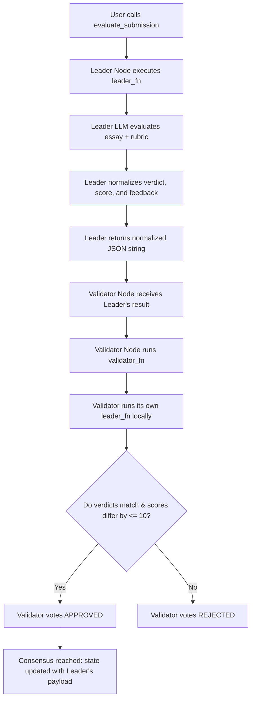

# Subjective Essay Evaluator

A decentralized educational primitive built on GenLayer (v0.2.16). 

This contract allows EdTech platforms, schools, or independent teachers to submit student writing (essays, short answers, paragraphs) along with a specific grading rubric. The GenLayer decentralized AI validator network acts as a consensus-backed jury to evaluate the essay, assign a qualitative grade (verdict), compute a numeric score, and write constructive educational feedback to the blockchain.

---

## 🌟 Reusable Educational Primitive (Beyond a "One-Off Demo")

Most blockchain-AI examples are simple "AI decides X" wrappers. The **Subjective Essay Evaluator** is designed as a **decentralized infrastructure block (primitive)** that other developers and platforms can plug directly into their workflows:

1. **LMS & EdTech Integration:**
   An online Learning Management System (LMS) can integrate this contract to automate writing assessments. Instead of relying on a centralized, opaque grading API (which could change, go offline, or suffer from single-provider bias), they get a multi-model, decentralized consensus-backed grade that is permanent and transparent.
2. **Dynamic Rubric Support:**
   The contract is fully parameterized. The grading criteria are not hardcoded. A teacher can submit a Grade 4 spelling rubric, while another platform can submit a university-level creative writing rubric. The same contract serves all assessment standards.
3. **Decentralized Academic Credentials:**
   Graded records are stored immutably. If a student passes a consensus-verified rubric, their achievement can be trustlessly verified by external protocols (e.g., for issuing educational NFTs, proof-of-competence credentials, or automatically unlocking subsequent lesson modules).

---

## 🏗️ Storage & State Design

The contract maintains state using optimized GenLayer v0.2.16 storage patterns:

*   **`EvaluationRecord` (Struct):**
    An `@allow_storage @dataclass` holding the student's submission text, the rubric, the agreed categorical verdict, the numeric score (as a `bigint`), and the qualitative feedback.
*   **`evaluations` (TreeMap):**
    A persistent lookup table mapped from `str(eval_id)` to `EvaluationRecord`. Mappings are indexed using strings to prevent schema validation failures.
*   **`next_id` (bigint):**
    An auto-incrementing identifier tracking the total number of evaluations recorded in the state.

---

## 🤝 Custom Validator Consensus Logic

Subjective text grading is inherently prone to minor variations. If two LLMs evaluate the same essay, they may output slightly different words for feedback and deviate by a few points in the score. 

To solve this, the contract implements a **Custom Meaning-Based Validator** via `gl.vm.run_nondet_unsafe(leader_fn, validator_fn)`:



### How Consensus works on subjective data:
1.  **Normalization:** Both the leader and validator run a normalization layer over the LLM output. The raw verdict is coerced into one of three strict categories: `EXCELLENT`, `SATISFACTORY`, or `NEEDS_IMPROVEMENT`. Numeric scores are coerced to `0..100` integers.
2.  **Category Equality:** The validator checks if its own local judgment results in the **exact same verdict category** as the leader's.
3.  **Close Score Banding:** The validator checks if its numeric score is within an **absolute difference of 10 points** compared to the leader's score (`abs(leader_score - mine_score) <= 10`).
4.  **Feedback Exemption:** The validator **ignores** differences in the natural language `feedback` text. As long as the verdict category matches and the scores are in the same neighborhood, the leader's specific feedback is accepted as valid. This prevents consensus failures due to harmless synonym variations in the generated paragraphs.

---

## 🧪 Edge Case Testing Guidelines

You can test the contract using the GenLayer Studio or CLI. Here is how to evaluate critical scenarios:

### 1. Happy Path: High-Quality Essay
*   **Submission Text:** "Global warming is a major challenge for our planet. It is caused by greenhouse gases trapping heat. We can reduce our carbon footprint by using renewable energy like solar and wind power, recycling more, and walking instead of driving."
*   **Rubric:** "Evaluate the student's understanding of global warming causes and solutions. To get EXCELLENT, they must mention greenhouse gases and at least two distinct solutions."
*   **Expected Result:** Verdict: `EXCELLENT`, Score: `85-100`, Feedback congratulating the student on clear examples.

### 2. Edge Case: Empty Submission or Rubric
*   **Inputs:** `submission_text = ""` or `rubric = ""` (or whitespace only).
*   **Expected Result:** The contract throws a `UserError` immediately before starting the LLM process, saving gas:
    *   `submission_text must not be empty`
    *   `rubric must not be empty`

### 3. Edge Case: Off-Topic / Nonsensical Text
*   **Submission Text:** "Banana soup is delicious when mixed with potato chips. Yesterday I saw a blue dog riding a skateboard."
*   **Rubric:** "Explain how photosynthesis works in green plants."
*   **Expected Result:** Verdict: `NEEDS_IMPROVEMENT`, Score: `< 20`, Feedback pointing out that the student did not address the topic of photosynthesis.

---

## 🚀 How to Deploy & Use (GenLayer Studio)

1.  Open the **[GenLayer Studio](https://studio.genlayer.com/contracts)**.
2.  Reset Storage: Go to **Settings** -> **Reset Storage** -> **Confirm**, then hard-reload your browser to clear any simulator caching.
3.  Create a new file named `subjective_essay_evaluator.py` and paste the contents of `subjective_essay_evaluator.py`.
4.  Click **Deploy**. Verify that the deployment finishes with `Result: SUCCESS` in the transactions sidebar.
5.  Call `evaluate_submission` with your test essay and rubric.
6.  Query `get_evaluation` using `"0"` (the ID of the first evaluation) to see the consensus-agreed JSON record.
7.  Check `get_total_evaluations` to see it return `1`.

---

## 🌐 Deployment & Test Evidence

*   **Contract Address:** `0x34cCB2c8B1D9181cA728B3d7FD3CAb9a4665dfB1`
*   **Network:** `studionet`

### Worked Example (Illustrative Example)

#### Example Call:
```python
contract.evaluate_submission(
    submission_text="Subjective grading is difficult because different people look for different criteria. In our science class, the essay about chloroplasts was graded by two peers. One peer gave a B and another gave an A- because of layout.",
    rubric="Grade the essay for grammatical structure and clear flow. Assign an integer score and category."
)
```

#### Expected Output (JSON from `get_evaluation` view):
```json
{
  "id": "0",
  "submission_text": "Subjective grading is difficult because different people look for different criteria. In our science class, the essay about chloroplasts was graded by two peers. One peer gave a B and another gave an A- because of layout.",
  "rubric": "Grade the essay for grammatical structure and clear flow. Assign an integer score and category.",
  "verdict": "SATISFACTORY",
  "score": 82,
  "feedback": "The essay effectively highlights the challenge of subjective peer grading and chloroplast evaluation. Flow is clear, but structure could be improved."
}
```
*Note: The feedback field is illustrative of the natural language response, while the verdict and score band represent the verified consensus values.*
